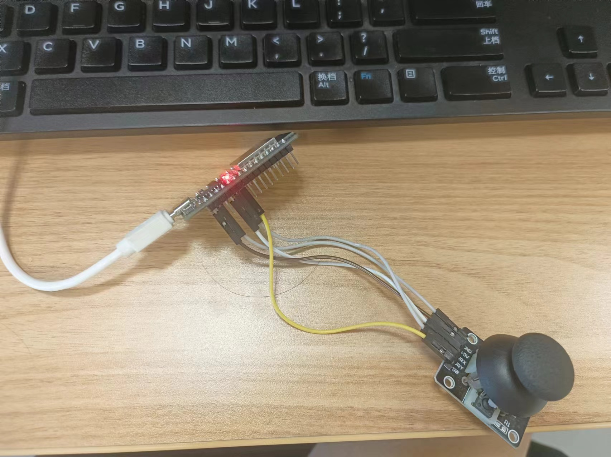

# cursor

this proj is begain by half learning and half interest, i am interested in this because what to finally build a Thinkpad TracePoint-link curosr to use in daily life

---

1.1_button-esp32-pythonInPC is using the button to contrl the cursor in PC

the Pin connections between esp32 and button are:

D2 -->VRX
D4 --> VRY
D17 --> SW(not in use)

and esp32 connect PC at COM10

